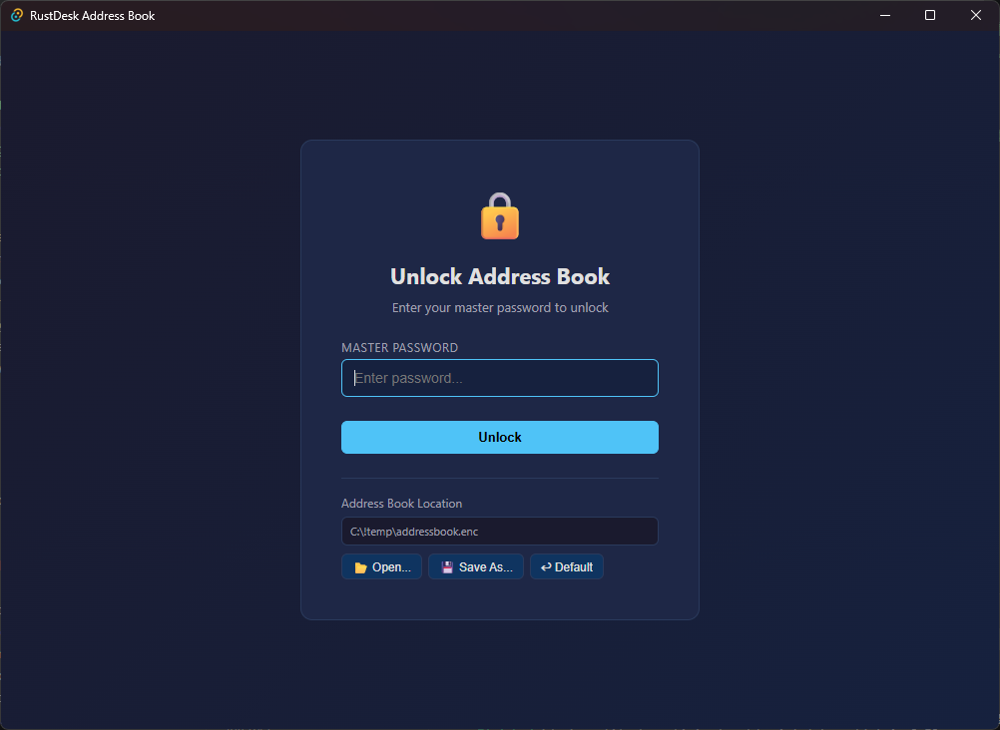
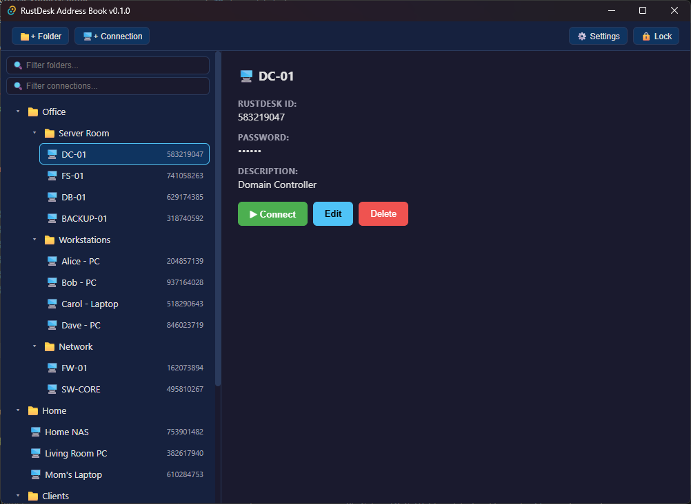
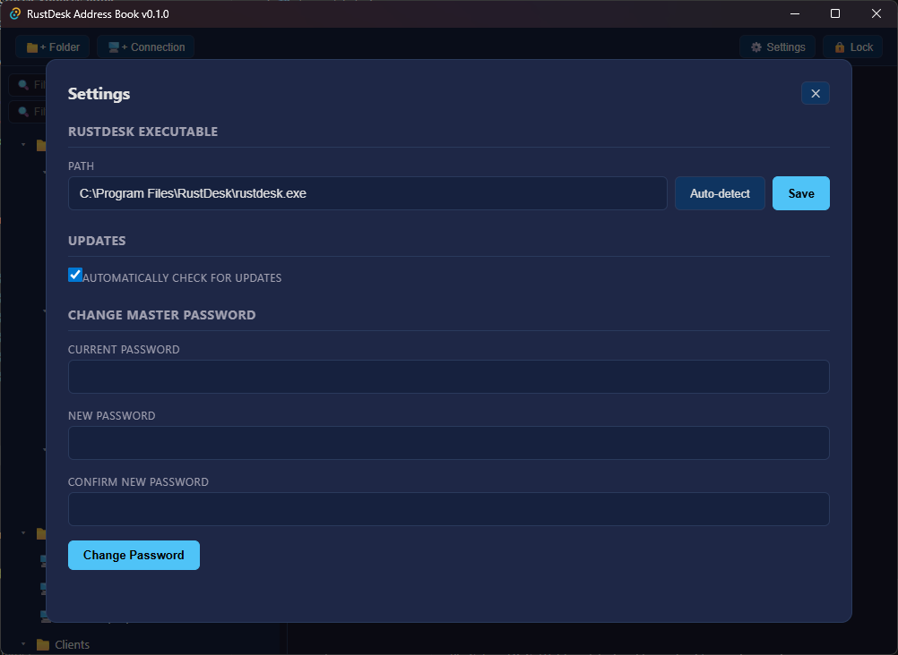

# RustDesk Address Book

A workaround app for managing [RustDesk](https://rustdesk.com/) connections as an encrypted local address book with folder hierarchy. RustDesk lacks a convenient built-in address book for self-hosted setups — this tool fills that gap by storing connections locally in an encrypted file and launching RustDesk with `--connect` and `--password` parameters.

## ⚠️ Disclaimer

- **For personal use only.** The author takes no responsibility for the correct operation of this application. Use at your own risk.
- **Tested on Windows only.** macOS and Linux builds are provided via CI but have not been verified. If something doesn't work on your platform, please [open an issue](https://github.com/ihtfw/rustdesk-address-book/issues) — I may look into it when I have time.
- Passwords and connection data are encrypted with AES-256-GCM + Argon2id, but the author makes no security guarantees.

## Features

- 🔒 Encrypted storage (AES-256-GCM + Argon2id key derivation)
- 📁 Nested folder hierarchy with drag-and-drop
- 🔍 Search/filter by folder name and connection name
- 🚀 One-click connect — launches RustDesk with `--connect` and `--password`
- 📂 Configurable storage path (e.g. Dropbox/OneDrive for sync)
- 🔄 Auto-updates via GitHub Releases
- 🖥️ Cross-platform (Windows, macOS, Linux)

## Screenshots

|                 Lock Screen                 |                Main Page                |               Settings                |
| :-----------------------------------------: | :-------------------------------------: | :-----------------------------------: |
|  |  |  |

## Architecture

### Tech Stack

| Layer       | Technology                                                          |
| ----------- | ------------------------------------------------------------------- |
| Framework   | [Tauri v2](https://v2.tauri.app/) — Rust backend + webview frontend |
| Frontend    | React 19 + TypeScript 5.8 + Vite 7                                  |
| Encryption  | `aes-gcm` 0.10 (AES-256-GCM) + `argon2` 0.5 (Argon2id KDF)          |
| Storage     | Encrypted JSON file, atomic writes                                  |
| Auto-update | `tauri-plugin-updater` with GitHub Releases                         |

### Rust Backend Modules

- **`crypto`** — encryption/decryption with AES-256-GCM, key derivation via Argon2id
- **`storage`** — encrypted file I/O, app config (storage path, auto-update preference)
- **`models`** — data structures: `AddressBook`, `Folder`, `Connection`, `TreeNode`
- **`commands`** — Tauri IPC command handlers (CRUD, auth, settings)
- **`rustdesk`** — auto-detection and launching of the RustDesk executable
- **`errors`** — error types with serialization for frontend

### Frontend Components

- **`LockScreen`** — master password entry, file path selection
- **`MainPage`** — tree view, search filters, connection/folder forms
- **`Settings`** — RustDesk path, auto-update toggle, password change

## Building from Source

### Prerequisites

- [Node.js](https://nodejs.org/) (v18+)
- [Rust](https://rustup.rs/) (stable)
- Platform-specific dependencies:
  - **Windows:** WebView2 (included in Windows 10/11)
  - **macOS:** Xcode Command Line Tools
  - **Linux:** `libwebkit2gtk-4.1-dev libappindicator3-dev librsvg2-dev patchelf`

### Setup

```bash
# Clone the repo
git clone https://github.com/ihtfw/rustdesk-address-book.git
cd rustdesk-address-book

# Install frontend dependencies
npm install

# Run in development mode (hot-reload)
npx tauri dev

# Build for production
npx tauri build
```

### Signing Updates (for releases)

```bash
# Generate signing keys (one-time)
npx tauri signer generate -w ~/.tauri/rustdesk-address-book.key

# Build with signing (set env vars)
# Windows:
$env:TAURI_SIGNING_PRIVATE_KEY = "content of your .key file"
npx tauri build
```

## Contributing

If you'd like to help — PRs are welcome. Fork the repo, create a branch, and submit a pull request. Please test on your platform before submitting.

## License

[MIT](LICENSE)
